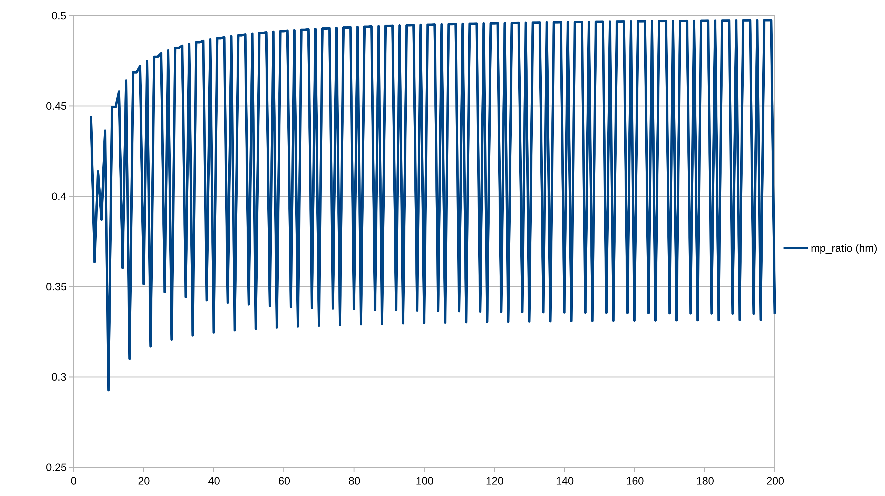
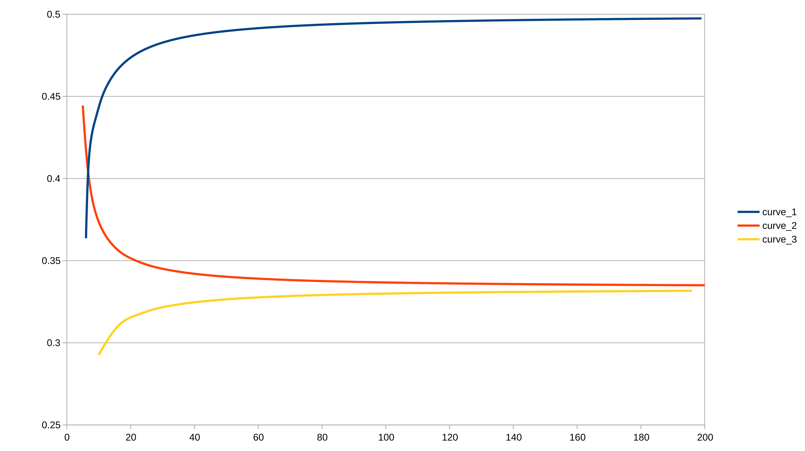
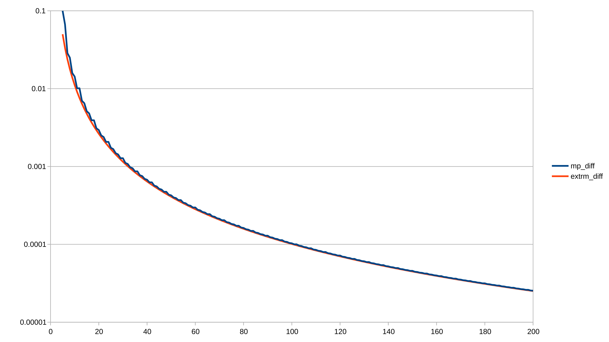
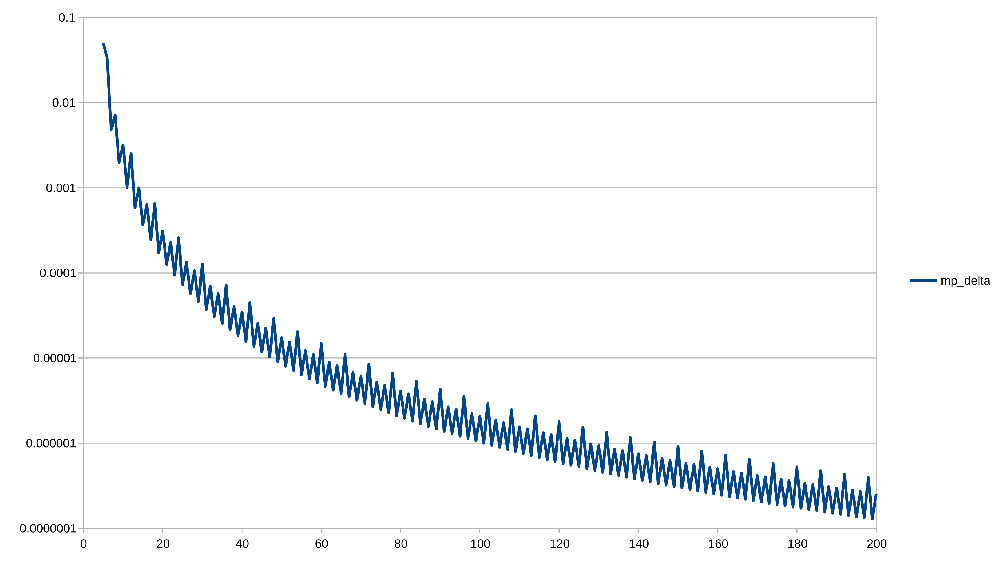

# Ratio Math

## Closest Ratios

### High-Level Question

**Gven a maximum denominator value, what is the smallest possible numerical difference
between two non-identical ratios between 0 and 1?**  We are assuming only integer
numerators and denominators (where the numerator is smaller than the denominator).

### A Little Background

This question was motivated by the need to know the precision required to represent
certain statistics in an application implementing leaderboards and analysis reports for a
card-playing tournament.  The specific statistic involved is "points percentage", which is
used as a tie-breaker for rankings.  In this particular case, the maximum number of points
that can be racked up between two teams in a game is 19 (a score of 10 to 9), and the
maximum number of games a team can play in a tournament stage is 8.  Thus, the maximum
total points (i.e. the denominator for computing points percentage) is `19*8 = 152`.  We
need to know how many decimal places must be displayed so that close stats and identical
stats can be distinguished with a glance.

### Starting In on the Math

A naive first thought might be that the finest level of granularity for the driving use
case is `1/152 = 0.006578`.  But, just a tiny bit of consideration will suggest that
various combinations of unrelated numerators/denominators may "happen to" yield values
that are closer together than that.  And by playing around for 30 or 40 seconds on a
calculator (*a what?*)  I can easily find an example of this: the difference between
`45/133` and `48/142` is `0.0003177`, or 20 times smaller than `1/152` from the naive
first thought.

Question: so then, **what is a rigorous mathematical approach to figuring out how to find
the smallest gap between two constructible ratios with demoninators not greater than
152?**

Answer (or at least my answer): I have no idea.

### Applying Brute Force

Since I can't do it the elegant way, I turn to Python.  See the `closest_ratios.py` script.

This approach yields the following pair of closest ratios: `1/151` and `1/152`, with a
difference of just `0.00004357`.  There are a few interesting things about this result:

- This is located at what I will call one of the "extremities" of the domain space, or
  `1/max_denom` (the smallest possible ratio).  The other extremity involves the highest
  possible ratio (`(max_denom-1)/max_denom`), which (unsurprisingly) yields the same
  difference with its paired neighbor ratio (obtained by subtracting one from both the
  numerator and demoninator).
- The distance between these two ratios at the extremity is quite a bit smaller than the
  example pair I stumbled upon using my calculator above—it is, in fact, 151 times smaller
  than `1/152`.  Not *approximately* 151 times smaller, but ***exactly*** 151 times
  smaller.  Coincidence?  I'll leave the answer to that as an exercise for to the reader
  to figure out.

### Some Exploration

We really could just stop here, since we now have our answer as to how many decimal places
we need to represent points percentages with differences unequivocably represented.  But
since we have the program running, maybe we can poke around and explore some variations
and/or extensions of this problem.  As I start looking at the closest ratios for other
maximum denominators, both larger and smaller than 152, and I see that the solution for
every single one of the cases examined is also at the extremity of the ratio domain.

So, a restatement of the previous question could be: **will the closest ratio pair
*always* be at the extremities for every maximum denominator value?**  A counter-example
would clearly answer the question, but even if we are not able to find one using brute
force (and I have run the script out past `max_denom = 9900`), can we prove that a "middle
of the pack" solution is possible for some maximum denominator value?  Even if
*theoretically* possible, does that mean the solution necessarily exists (I don't know
that is a valid mathematical question—perhaps not).

To help us address some of these questions, we do a little bit of algebra to confirm that
the solution space is symmetrical around the midpoint of the numerator domain—that is,
every pair of ratios, `(num1/denom1)` and `(num2/denom2)`, has a companion pair,
`((denom1-num1)/denom1)` and `((denom2-num2)/denom2)`, with an identical numerical
difference.  Thus, we can narrow our consideration for analysis and/or developing a
formula to the first half of possible numerators for any given denominator (`num ≤
denom/2`).  We note that none of the ratio differences we are interested in spans the two
halves of the domain.

### Drilling Down on Midpack Solutions

We make a tweak to the script to allow us to exclude the ratios at the extremities from
consideration, to see how close ratios from the middle of the pack can get (even if not
the absolute closest), and whether a discernable pattern will emerge for *where* the
closest midpack ratios turn out to be in the domain space.  The midpack solution for our
`max_denom = 152` case is revealed to be the ratio pair of `51/152` and `50/149`,
with a difference of `0.00004415`.  This is pretty darn close to the best extremity case
discussed above (just a 1.3% deviation).

Running the script for midpack solutions at other maximum denominators we get the
following:

```bash
$ python -m closest_ratios 200 midpack trace
5: (2, 5), (2, 4), 0.100000000000, True
6: (2, 6), (2, 5), 0.066666666667, True
7: (2, 5), (3, 7), 0.028571428571, True
8: (3, 8), (2, 5), 0.025000000000, True
9: (3, 7), (4, 9), 0.015873015873, True
10: (2, 7), (3, 10), 0.014285714286, True
11: (4, 9), (5, 11), 0.010101010101, True
12: (4, 9), (5, 11), 0.010101010101, True
13: (5, 11), (6, 13), 0.006993006993, True
14: (5, 14), (4, 11), 0.006493506494, True
15: (6, 13), (7, 15), 0.005128205128, True
16: (4, 13), (5, 16), 0.004807692308, True
17: (7, 15), (8, 17), 0.003921568627, True
18: (7, 15), (8, 17), 0.003921568627, True
19: (8, 17), (9, 19), 0.003095975232, True
20: (7, 20), (6, 17), 0.002941176471, True
21: (9, 19), (10, 21), 0.002506265664, True
22: (6, 19), (7, 22), 0.002392344498, True
23: (10, 21), (11, 23), 0.002070393375, True
24: (10, 21), (11, 23), 0.002070393375, True
      .
      .
      .
181: (89, 179), (90, 181), 0.000030865150, True
182: (61, 182), (60, 179), 0.000030695561, True
183: (90, 181), (91, 183), 0.000030190502, True
184: (60, 181), (61, 184), 0.000030026423, True
185: (91, 183), (92, 185), 0.000029537734, True
186: (91, 183), (92, 185), 0.000029537734, True
187: (92, 185), (93, 187), 0.000028905911, True
188: (63, 188), (62, 185), 0.000028752156, True
189: (93, 187), (94, 189), 0.000028294146, True
190: (62, 187), (63, 190), 0.000028145229, True
191: (94, 189), (95, 191), 0.000027701598, True
192: (94, 189), (95, 191), 0.000027701598, True
193: (95, 191), (96, 193), 0.000027127472, True
194: (65, 194), (64, 191), 0.000026987640, True
195: (96, 193), (97, 195), 0.000026571011, True
196: (64, 193), (65, 196), 0.000026435445, True
197: (97, 195), (98, 197), 0.000026031498, True
198: (97, 195), (98, 197), 0.000026031498, True
199: (98, 197), (99, 199), 0.000025508252, True
200: (67, 200), (66, 197), 0.000025380711, True
```

Some interesting pattern emerge.  There appear to be repeating groups of 6 records with
the following properties:

- For 5 out of the 6 records in the cycle, one of the ratios contains `max_denom` as the
  denominator
  - Starting with `max_denom ≡ 1 (mod 6)`, the ratio within the pair (either the first or
    the second) with the maximum denominator is: 2, 1, 2, 2, 2
  - See records for `max_denom` of 7 through 11, for example
- The record in the cycle that does *not* contain `max_denom` as a denominator is
  `max_denom ≡ 0 (mod 6)`
  - In these cases, the closest ratios are a repeat of the previous record (described by
    `max_denom ≡ 5 (mod 6)`), and the second (larger) ratio contains `max_denom-1` as the
    denominator
  - See records for `max_denom` of 12, 18, 24 on the low end, or 186, 192, 198 higher up,
    for examples

By visual inspection of the numbers, it's hard to tell exactly what the patterns are in
terms of the actual closest ratio values themselves.  But if we graph them out, we see
some very clear order the the ratios (note that we are plotting the harmonic mean of the
ratio pairs here):

<p align="center">
  
</p>

We can see the regularly repeated cycle of 6 records in the up and down jumps in the
solution set.  But in addition, the local minima and maxima within each cycle appear to
trace out three distinct curves, depicted here:

<p align="center">
  
</p>

As a point of interest, it should be noted that the bottom two curves are asymptotically
converging from above and below on a value that looks suspiciously like `1/3` by the
numbers (for example, `0.333400` and `0.333266`, as `max_denom` approaches `5000`).

Revisiting the question of how close the best midpack ratio distance is compared to that
of the lowest extremity ratio pair, we can plot the actual differences (overlaid on each
other), as well as the delta between the two:

<p align="center">
  
</p>

<p align="center">
  
</p>

The deltas appear to follow a very orderly sequence.  The larger shape of the curve is
very well formed, and the smaller spikes within the curve show perfect regularity, again
in groups of 6 data points.  It also turns out that the larger up-spike in each grouping
corresponds to `max_denom ≡ 0 (mod 6)`, for which the closest ratio pair is a repeat of
`max_denom-1`.

### Making Sense of All This?

Revisiting the previous questions (highlighted above), it *appears* that the patterns are
completely regular, and therefore *almost certainly* mathematically describable (right?).
If this is actually the case, then there is *almost certainly* not a midpack ratio pair
closer than the ratios at the extremities.

But visual inspection and sampled data pattern matching is far from a closed form
derivation, so the following mathematical questions must be asked:

- Why those groups of 6?
  - Why the failure to find a new, closer midpack ratio pair whenever extending the max
    denominator to a value of `max_denom ≡ 0 (mod 6)`?
- What is the shape of those three curves (representing midpack ratio local minima and
  maxima)?
  - Why do the bottom two curves appear to converge at `1/3`?
- What is the shape of delta curve (representing relative closeness of extremity and best
  midpack solution ratio pairs)?
- How did the number `3` get pulled into all of this (represented by both the `1/3`
  asymptote and the groups-of-6 thing)?

I don't have any of the math needed to answer these questions, or even take this problem
any further in the pencil and paper realm.  I think this problem fits in the category of
number theory, or some other form of discrete math.

Can anyone help out here?
